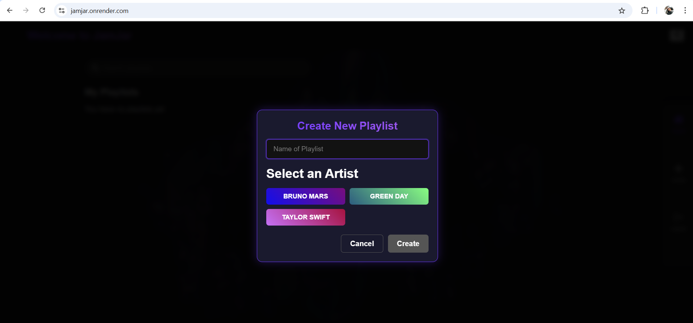

# JamJar

## 🎵 🚀 MERN Stack Playlist App
Jam Jar is a modern MERN stack playlist manager (MongoDB, Express.js, React, Node.js) that empowers users to create, edit, and manage their perfect music collections through full CRUD operations. This full-featured application combines cutting-edge technology with intuitive design to deliver a seamless music organization experience, backed by a powerful MongoDB database for reliable data management."

## 📦 Features
✅ Add, update, and delete playlists

✅ Add and remove songs from playlists

✅ Responsive UI built with React

✅ RESTful API using Express and Node

✅ MongoDB schema design for nested song data

## Tech Stack

MongoDB – NoSQL database to store playlists and song data

Express.js – Backend API framework

React.js – Frontend library for dynamic UI

Node.js – JavaScript runtime for the server

## 🔗 API Endpoints

Method	Route	Description
GET	/api/playlists	Get all playlists
POST	/api/playlists	Create new playlist
GET	/api/playlists/:id	Get playlist by ID
PUT	/api/playlists/:id	Update playlist
DELETE	/api/playlists/:id	Delete playlist

## 📜 License
This project is licensed under the MIT License - see the LICENSE file for details.

## 🔮 Future Enhancements
Spotify API integration

Collaborative playlists

Music recommendation engine

Offline mode support

## 🌐 Live Deployment link
Access the live application: https://jamjar.onrender.com/ 

## 👥 Github Repo Link & Contributors
https://github.com/ikranahmed/JamJar
https://github.com/ikranahmed
https://github.com/Gastons2023
https://github.com/Zacharia-Owen

